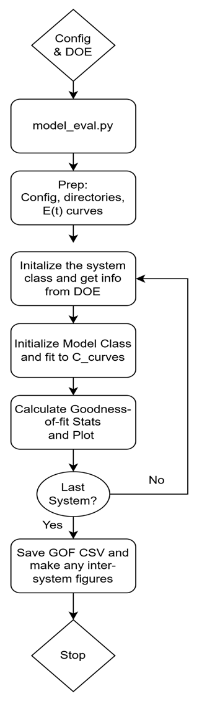
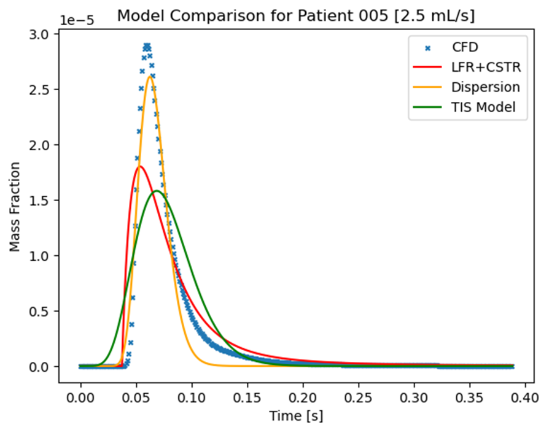

# TRANSONIC
**Tr**ansit time **An**alysis and **S**tatistics **O**f coro**n**ary **I**ndicator-Dilution **C**urves

## Statement of Purpose

Unlock the power of RTD insights: Rapidly prototype, visualize, and optimize transport models to drive solutions to your transit time problems.

## SETUP

To use TRANSONIC, first clone the github repository via
```
git clone "https:github.com/matmulmiller/TRANSONIC"
```
For best practices, it is best to create a new python virtual environment to contain the package dependencies.

Next you can install the package dependencies via running the following from within the cloned base directory

```
python setup.py install
```
or

```
python -m pip install .
```

## Running your first case

To test out your setup, we have included an example dataset "examples/stenosed_tube". To execute the analysis from scratch execute

```
python3 -m src.script.model_eval -c testing/configs/base.yaml
```

## General case flow
The general algorithm for running TRANSONIC on experimental datasets: 


## Example of provided results

A visual comparison of a Tanks-in-Series, Taylor-Dispersion, and user-defined model against experimental data:
 
